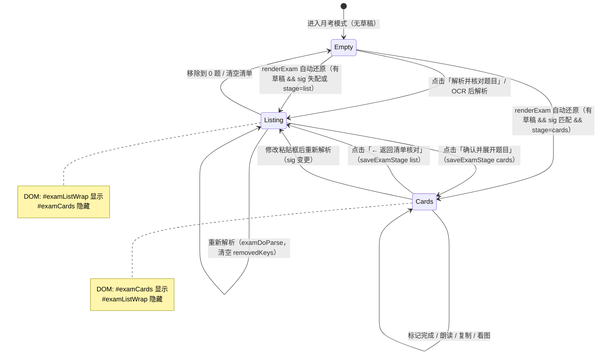
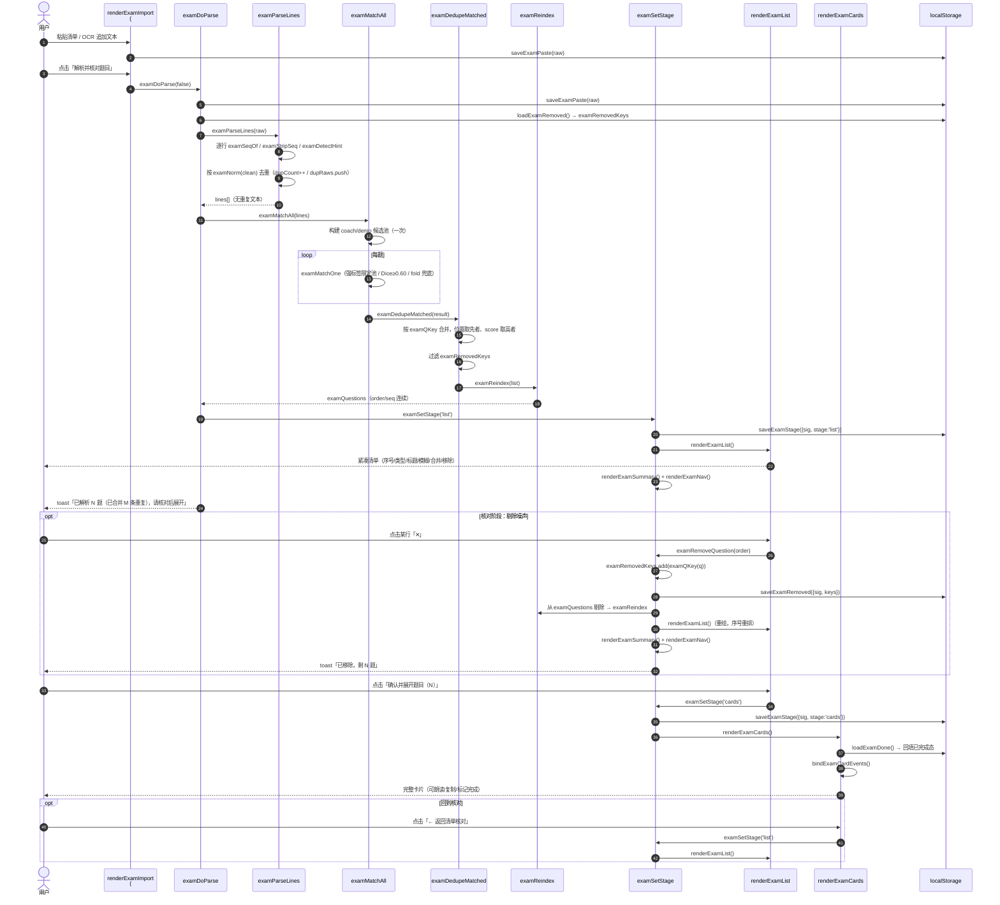
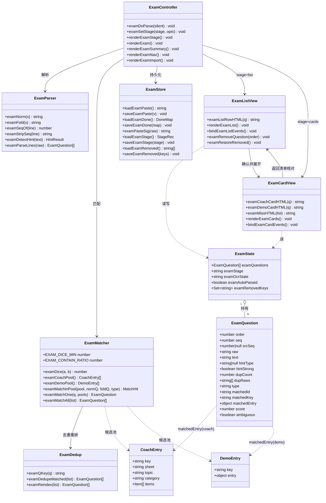
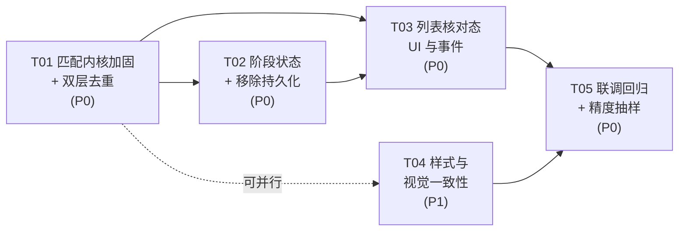

# 知鸟答案工作台 · 月考模式增量设计文档

> 架构师：高见远（software-architect）
> 目标文件：`/Users/zhoujiale/WorkBuddy/2026-08-04-16-18-01/知鸟答案工作台.html`（单文件 HTML，inline CSS + JS，约 2652 行）
> 版本：v1.0（增量设计，不含实现代码）
> 覆盖诉求：① 解析去重 ② 列表核对态 ③ 匹配精度提升方案（咨询 + 推荐默认组合）

---

## 1. 增量设计概述

本次增量在**不改变月考模式既有数据流与视觉语言**的前提下，于「解析 → 匹配 → 渲染」链路中间**插入两层新能力**：一是在解析层与匹配层各加一道**幂等去重**（解析层按 `examNorm(text)` 归一文本去重、匹配层按 `type::matchedKey` 命中目标去重），消除「同一题出现两次」和「两条不同文字指向同一话术生成两张同名卡」两类重复；二是在匹配完成与卡片渲染之间插入一个**列表核对态（`examStage='list'`）**，先以每行一题的紧凑清单呈现「序号 / 类型徽标 / 匹配到的标题 / 模糊标记 / 合并标记 / 单条移除」，用户核对并剔除 OCR 噪声后点「确认并展开题目」再进入原有的 `renderExamCards()` 卡片态。同时对匹配内核做**低风险精度加固**（全角半角归一、噪声词剥离、OCR 形近字折叠比较、Dice 阈值 0.55→0.60、包含匹配增加长度比约束、显式 `[话术]/[演示]` 标签强制限定候选池）。三者叠加形成「算法收敛 + 人在回路兜底」的双保险：算法降低误命中，列表核对态把剩余误差交给用户一键剔除，整体零后端、零新依赖，仍为纯静态单文件部署。

---

## 2. 改动文件与代码位置清单

单文件应用，以下「文件」实为同一 HTML 内的**代码区块**，按行号定位（行号基于当前 2652 行版本，实现时以函数名为准，行号仅作导航）。

| # | 区块 | 行号范围 | 改动性质 | 说明 |
|---|------|---------|---------|------|
| C1 | CSS · 月考样式 | `624–650` | **新增** | 追加 `.exam-list` / `.exam-list-head` / `.exam-list-row` / `.exam-list-title` / `.exam-list-del` / `.exam-list-dup` / `.exam-list-foot` / `.exam-type.miss` / `.exam-list-back`，并补移动端断点。既有类不动。 |
| C2 | HTML · `#examWrap` 容器 | `795–799` | **修改（插入 1 行）** | 在 `#examSummary`（797）与 `#examCards`（798）之间插入 `<div class="exam-list-wrap" id="examListWrap" style="display:none"></div>`。 |
| C3 | JS · localStorage key 常量 | `1029` | **修改** | 追加 `K_EXAM_STAGE='wb_zhiniao_exam_stage'`、`K_EXAM_REMOVED='wb_zhiniao_exam_removed'`。 |
| C4 | JS · 月考状态变量 | `1063` | **修改** | `let examQuestions=[], examOcrState='idle', examAutoParsed=false;` → 追加 `examStage='list'`、`examRemovedKeys=new Set()`。 |
| C5 | JS · `examNorm` | `2146–2152` | **重构（增强）** | 全角→半角、`\u3000` 清理、扩展噪声剥离（分值/前缀/修饰标签）。保持函数签名与返回类型不变。 |
| C6 | JS · 新增 `examFold` | `2152` 后 | **新增** | OCR 形近字折叠串生成器，**仅供相似度兜底比较**，不参与精确匹配。 |
| C7 | JS · `examDetectHint` | `2186–2201` | **修改** | 返回值增加 `strong:boolean`——显式 `[话术]/[演示]` 方括号标签为 `strong=true`，正文含「演示/话术」二字推断为 `strong=false`。 |
| C8 | JS · `examParseLines` | `2224–2235` | **修改** | 返回前按 `examNorm(clean)` 去重（保留首次出现、保留原顺序）；记录 `srcSeq`、`dupCount`、`dupRaws[]`。 |
| C9 | JS · `examMatchInPool` | `2259–2275` | **修改** | ① 包含匹配（0.9）增加长度比约束；② Dice 阈值 `0.55→0.60`（常量化为 `EXAM_DICE_MIN`）；③ 引入 `examFold` 折叠串兜底打分（×0.98 折扣）；④ 返回 top2 以支持歧义标记。 |
| C10 | JS · `examMatchOne` | `2277–2308` | **修改** | 强类型提示（`hint.strong`）→ **只在对应池匹配**；弱提示保留 `+0.05` 排序偏好；输出增加 `ambiguous`。 |
| C11 | JS · `examMatchAll` | `2310–2314` | **修改** | 匹配后串联 `examDedupeMatched()` → `examReindex()`；并过滤 `examRemovedKeys`。 |
| C12 | JS · 新增去重/重排工具 | `2314` 后 | **新增** | `examQKey(q)`、`examDedupeMatched(list)`、`examReindex(list)`。 |
| C13 | JS · stage / removed 持久化 | `2317–2318` 附近 | **新增** | `loadExamStage()` / `saveExamStage()` / `loadExamRemoved()` / `saveExamRemoved()` / `examPasteSig()`。 |
| C14 | JS · 新增列表渲染 | `2429` 后（`examMissHTML` 之后） | **新增** | `examListRowHTML(q)`、`renderExamList()`、`bindExamListEvents()`。 |
| C15 | JS · 新增阶段调度 | `2453` 附近 | **新增** | `renderExamStage()`、`examSetStage(stage, opts)`、`examRemoveQuestion(order)`、`examRestoreRemoved()`。 |
| C16 | JS · `renderExamCards` | `2432–2453` | **修改（小）** | 卡片区顶部渲染「← 返回清单核对」按钮（`.exam-list-back`）；空态文案微调。 |
| C17 | JS · `examDoParse` | `2516–2533` | **修改** | 解析成功后不再直接进卡片态，改为 `examSetStage('list')`；toast 文案改为「已解析 N 题，请核对后展开」，并在去重发生时追加「（已合并 M 条重复）」。 |
| C18 | JS · `renderExamImport` | `2536–2557` | **修改（小）** | 主按钮文案「解析并调出题目」→「解析并核对题目」；`.exam-hint` 补一句「解析后先出清单，核对无误再展开」。 |
| C19 | JS · `renderExamSummary` | `2559–2586` | **修改（小）** | 统计增加「已移除 n」（可点击恢复）；`#examClearDone` 的 DOM 同步在 list 态下需跳过 `#examGrid` 查询保护。 |
| C20 | JS · `renderExamNav` | `2588–2602` | **修改（小）** | 用法文案更新为「粘贴清单 → 解析核对 → 确认展开 → 按序作答 → 标记完成」。 |
| C21 | JS · `renderExam` | `2604–2615` | **重构** | 自动还原后进入 `renderExamStage()` 而非直接 `renderExamCards()`；stage 从签名匹配的 localStorage 恢复。 |
| C22 | JS · `examRunOCR` | `2648–2686` | **不改（本轮）** | 方案 E（OCR 后校正）列为可选下一步，本轮不动，仅由列表核对态兜底。 |

**明确不改动**：`setSection`（2112–2129）、`#sectionTitle` / `#searchInput` 处理、`render()` 分发（1764–1766）、`examDoneKey` / `loadExamDone` / `saveExamDone`（2321–2338）、`bindExamCardEvents`（2455–2513）核心逻辑、`examCoachPool` / `examDemoPool`（2238–2257）、`examCoachCardHTML` / `examDemoCardHTML`（2348–2421）。

---

## 3. 数据结构与状态变更

### 3.1 新增全局状态（C4，行 1063）

```
examStage        : 'list' | 'cards'    // 当前阶段，默认 'list'
examRemovedKeys  : Set<string>          // 用户在列表态手动移除的题目稳定标识
```

### 3.2 新增 localStorage 键（C3，行 1029）

| Key | 值结构 | 用途 | 失效策略 |
|-----|--------|------|---------|
| `wb_zhiniao_exam_stage` | `{ sig:string, stage:'list'\|'cards' }` | 记住用户是否已确认展开 | `sig` 与当前粘贴文本签名不符 → 视为 `'list'` |
| `wb_zhiniao_exam_removed` | `{ sig:string, keys:string[] }` | 记住手动移除的题，刷新后不复活 | 同上；`monthId` 变更时不强制清（清单本身会换） |

`examPasteSig(raw)`：对 `examNorm(raw)` 做轻量 djb2 哈希 + 长度拼接，返回短字符串。**签名只依赖粘贴原文**，用户改一个字 → 两个键自动失效 → 回到 list 态重新核对。这是防止「改了清单却沿用旧确认态/旧移除列表」的关键护栏。

### 3.3 `ExamQuestion` 字段扩展

解析层（`examParseLines`）产出的对象在现有 `{order, seq, raw, text, hintType}` 上扩展：

| 字段 | 类型 | 来源 | 说明 |
|------|------|------|------|
| `order` | number | 解析/重排 | **内部唯一定位键**，0-based 连续，`examFindByOrder`/`data-order` 依赖它 |
| `seq` | number | 重排 | **展示序号**，去重与移除后统一重排为 `order+1`，始终 1..N 连续 |
| `srcSeq` | number\|null | 原文行首序号 | 溯源用，列表行 `title` 属性显示「原第 X 题」；无序号时为 `null` |
| `raw` | string | 原始行文本 | 保留不变，未命中题的列表标题与 `examMissHTML` 使用 |
| `text` | string | 去序号去标签后的净文本 | 匹配输入 |
| `hintType` | 'coach'\|'demo'\|null | `examDetectHint` | 不变 |
| `hintStrong` | boolean | **新增** | 是否为显式方括号标签（决定是否限定候选池） |
| `dupCount` | number | **新增** | 该题合并了多少条原始行（含自身），`>1` 时列表显示「合并 N 条」 |
| `dupRaws` | string[] | **新增** | 被合并掉的原始行文本，供 `title` 悬浮溯源 |

匹配层（`examMatchOne`）在此基础上补 `{type, matchedId, matchedKey, matchedEntry, score}`（现有）+ 新增 `ambiguous:boolean`（top1 与 top2 分差 < 0.05）。

### 3.4 去重规则（核心）

**稳定标识 `examQKey(q)`**：

```
命中题（type !== 'unknown'）  →  q.type + '::' + q.matchedKey        // 与 examDoneKey 同构
未命中题（type === 'unknown'）→  'u::' + examNorm(q.text)
```

**第一道 · 解析层去重（C8，`examParseLines`）**

- 遍历行 → 计算 `key = examNorm(clean)` → `Set` 命中则**不新增**，而是把当前行 push 进已存条目的 `dupRaws` 并 `dupCount++`。
- 保留首次出现、保留原顺序。
- `order` 仍取 `out.length`（去重后天然连续）。

**第二道 · 匹配层去重（C11/C12，`examDedupeMatched`）**

- 遍历 `examMatchAll` 输出，以 `examQKey(q)` 为键建 Map。
- **冲突合并规则**：
  1. **位置以先出现者为准**（保留较小 `order`、其 `seq`/`raw`/`text`/`srcSeq`）——保证清单顺序稳定，用户视觉上题目不会跳动。
  2. **匹配结果取质量更高者**：若后来者 `score` 严格大于已存者，则用后来者的 `{matchedId, matchedKey, matchedEntry, score, type, ambiguous}` **覆盖**已存条目的匹配字段。
  3. `dupCount` 累加、`dupRaws` 合并。
- 分数相同 → 保留先出现者，不覆盖。

**第三道 · 移除过滤**：`examRemovedKeys` 中的 key 直接从结果剔除（在去重之后、重排之前）。

**重排 `examReindex(list)`**：按当前数组顺序重写 `order = index`、`seq = index + 1`。

> **关于 seq 的取舍（重要）**：主理人建议「保留 seq 显示、重排内部 order」。我**推荐进一步把 seq 也重排为 1..N 连续**，理由：① 月考按序作答，用户心智是「我在做第几题 / 还剩几题」，断号（1,2,4,7）会引发「是不是漏题了」的焦虑与反复核对；② 手动移除功能会让断号频繁出现，比去重更明显；③ 原始序号并未丢失，存于 `srcSeq`，列表行 `title` 与卡片 `data-src-seq` 均可溯源。此项已列入「待明确事项 8.2」，若主理人选择保留原序号，只需在 `examReindex` 中跳过 `seq` 重写即可，改动量 1 行。

**完成态兼容性**：`examDoneKey(q)` 本就是 `type::matchedKey`，与去重键同构。去重后一个 key 对应唯一卡片，`bindExamCardEvents`（2496–2501）中「同步所有同 key 卡片」的循环变为无害冗余，**保留不删**（防御性，兼容手动构造场景）。

---

## 4. 调用流程

### 4.1 阶段状态机（list ↔ cards）



### 4.2 解析 → 去重 → 核对 → 展开 时序



### 4.3 刷新自动还原流程（`renderExam` 改造）

```
renderExam()
  ├─ renderExamImport()                          // 只注入一次，不变
  ├─ if (!examAutoParsed && !examQuestions.length && loadExamPaste().trim())
  │     examAutoParsed = true
  │     examDoParse(true)                        // 静默解析 → 内部落到 'list'
  │     ├─ 读 loadExamStage()
  │     │   ├─ sig 匹配 && stage==='cards' → examSetStage('cards', {silent:true})
  │     │   └─ 否则                        → examSetStage('list',  {silent:true})
  │     └─ return
  └─ renderExamStage()                           // 按当前 examStage 切 display + 调对应 render
        ├─ renderExamSummary()
        └─ renderExamNav()
```

**推荐策略**：**记住上次确认状态**（sig 匹配且 `stage==='cards'` → 直接展开）。理由：月考作答途中刷新页面、或在 Ai Coach / Ai Demo / 月考三个 section 之间来回切换都很常见，若每次都强制回 list 会打断作答节奏、增加一次无意义点击；而「点过确认并展开」这个动作本身已表达用户完成核对。一旦粘贴文本变更（sig 失配）即自动回落 list，安全边界由签名守住。备选方案见「8.1」。

### 4.4 类图（模块与数据结构）



---

## 5. 任务分解列表

> 单文件应用，任务以「代码区块」为最小单位，每个任务覆盖 ≥3 个区块。全部 5 个任务，**严格按顺序实现**，每个任务完成后可独立自测。

### T01 · 匹配内核加固与双层去重（纯函数层）

- **优先级**：P0
- **依赖**：无
- **改动区块**：C5 `examNorm`(2146–2152)、C6 新增 `examFold`、C7 `examDetectHint`(2186–2201)、C8 `examParseLines`(2224–2235)、C9 `examMatchInPool`(2259–2275)、C10 `examMatchOne`(2277–2308)、C11 `examMatchAll`(2310–2314)、C12 新增 `examQKey`/`examDedupeMatched`/`examReindex`、常量区(2136–2137)
- **交付内容**：
  1. 常量化阈值：`EXAM_DICE_MIN=0.60`、`EXAM_CONTAIN_RATIO=0.5`、`EXAM_CONTAIN_MINLEN=4`、`EXAM_FOLD_PENALTY=0.98`、`EXAM_AMBIGUOUS_GAP=0.05`。集中放在 2137 行后，便于后续调参。
  2. `examNorm` 增强：全角字母数字→半角（`\uFF01–\uFF5E` 偏移 0xFEE0）、`\u3000`→空、剥离行尾分值 `（N分）/(N分)`、剥离前缀「题目：/考题：/试题：」、剥离修饰标签 `【必考】【重点】【新增】` 等。**保持返回小写、无空白、无标点的既有契约**。
  3. `examFold(s)`：在 `examNorm` 结果上把 OCR 高频同形字符收敛到同一符号（`o/0`、`l/1/i`、`s/5`、`z/2`、`b/8`、`g/9`）。**仅用于相似度兜底**，绝不参与精确等值判断。
  4. `examDetectHint` 返回增加 `strong`。
  5. `examParseLines` 解析层去重（按 `examNorm(clean)`），输出 `srcSeq`/`dupCount`/`dupRaws`/`hintStrong`。
  6. `examMatchInPool`：包含匹配加长度比与最小长度约束；Dice 用 `max(dice(norm), dice(fold)*0.98)`；返回 top1 与 top2 分数。
  7. `examMatchOne`：`hintStrong` 时只查对应池（另一池视为无候选）；弱提示保留 `+0.05`；输出 `ambiguous`。
  8. `examMatchAll`：串 `examDedupeMatched` → 过滤 `examRemovedKeys` → `examReindex`。
- **验收标准**：
  - 粘贴含 3 行完全相同的清单 → 只出 1 题，`dupCount===3`。
  - 粘贴「iPhone 17 买赠活动」与「iPhone 17 买赠」两行（指向同一话术）→ 只出 1 题，`score` 为两者较高值，`order===0`。
  - 「新机」不再以 0.9 命中「值享焕新 年年用新机」（长度比约束生效）。
  - `[演示] XXX` 强标签下，即便 coach 池分数更高也不会命中话术。
  - `examQuestions` 的 `order` 为 0..N-1 连续，`seq` 为 1..N 连续。

---

### T02 · 阶段状态、移除态与持久化

- **优先级**：P0
- **依赖**：T01
- **改动区块**：C3 key 常量(1029)、C4 状态变量(1063)、C13 新增 `examPasteSig`/`loadExamStage`/`saveExamStage`/`loadExamRemoved`/`saveExamRemoved`(2317–2318 附近)、C15 新增 `examSetStage`/`examRemoveQuestion`/`examRestoreRemoved`/`renderExamStage`、C21 `renderExam` 重构(2604–2615)、C17 `examDoParse` 改造(2516–2533)
- **交付内容**：
  1. 两个新 localStorage key + 4 个读写函数，全部 `try/catch` 包裹（与现有 `loadExamPaste` 风格一致，静态页面下 localStorage 可能被禁用）。
  2. `examPasteSig(raw)`：djb2 哈希 + 长度，返回如 `"a3f91c-284"`。
  3. `examSetStage(stage, opts)`：写内存 → 写 localStorage（`opts.silent` 时跳过 toast）→ 调 `renderExamStage()`。
  4. `examRemoveQuestion(order)`：定位 → 加入 `examRemovedKeys` → 持久化 → 从 `examQuestions` 剔除 → `examReindex` → 重绘 list + summary + nav → toast。**不修改 `#examPaste` 文本**。
  5. `examRestoreRemoved()`：清空 `examRemovedKeys` + 持久化 + 重新 `examDoParse(true)`。
  6. `renderExamStage()`：切 `#examListWrap` / `#examCards` 的 `display`，调用对应渲染函数，统一收尾 `renderExamSummary()` + `renderExamNav()`。
  7. `renderExam` 按 4.3 流程重构；`examDoParse` 结尾改为 `examSetStage('list')` 并调整 toast 文案。
  8. **签名护栏**：`examDoParse` 开头计算当前 sig，若与已存 stage/removed 记录的 sig 不符 → 清空 `examRemovedKeys` 并强制 stage='list'。
- **验收标准**：
  - 解析 → 移除 2 题 → 刷新页面 → 仍为 N-2 题且停在 list（若未确认过）。
  - 解析 → 确认展开 → 刷新 → 直接进 cards 态。
  - 在粘贴框改一个字 → 重新解析 → 回到 list 且被移除的题全部复现。
  - localStorage 不可用时（隐私模式）功能降级为「本次会话有效」，不报错。

---

### T03 · 列表核对态 UI 与事件

- **优先级**：P0
- **依赖**：T01、T02
- **改动区块**：C2 HTML 容器(795–799)、C14 新增 `examListRowHTML`/`renderExamList`/`bindExamListEvents`(2429 后)、C16 `renderExamCards` 加返回按钮(2432–2453)、C18 `renderExamImport` 文案(2536–2557)、C19 `renderExamSummary`(2559–2586)、C20 `renderExamNav`(2588–2602)
- **交付内容**：
  1. HTML 插入 `#examListWrap` 容器。
  2. 列表结构（DOM 草案，见 §7.2），逐行渲染：`.exam-seq` 序号 → `.exam-type`（coach/demo/miss）→ `.exam-list-title` → `.exam-fuzzy`（`score<1 && score>0`）→ `.exam-list-dup`（`dupCount>1`）→ `.exam-list-del`（✕）。命中题标题取 `matchedEntry.topic`（demo 取 `matchedEntry.entry.topic`），未命中取 `q.raw`。
  3. 行 `title` 属性：`原第 X 题 · 原文：{raw}`（+ `dupRaws` 列表）。
  4. 表头 `.exam-list-head`：`共 N 题 · 话术 a · 演示 b · 未找到 c`，右侧「清空清单」ghost 按钮。
  5. 表尾 `.exam-list-foot`：主按钮「确认并展开题目（N）」、ghost「重新解析」、（有移除项时）ghost「恢复已移除（n）」。
  6. `bindExamListEvents()`：全部用 `onclick` 直接赋值（与 `bindExamCardEvents` 风格一致，避免重复绑定），事件在每次 `renderExamList()` 后重绑。
  7. `renderExamCards` 顶部注入 `.exam-list-back` 返回按钮（在 `#examCards` 内 grid 之前，或作为 grid 第一个子节点前的兄弟节点）。
  8. 空态：`examQuestions.length===0` 时 list 容器渲染与 `.exam-empty` 同风格的提示。
  9. `renderExamSummary` 增加「已移除 n」，`renderExamNav` 用法文案更新；两者在 list / cards 两态下均正确（注意 2578–2582 行 `#examGrid` 查询在 list 态下为空，需 null 保护）。
- **验收标准**：
  - 解析后默认看到清单，卡片区隐藏；每行一题不换行溢出（长标题省略号）。
  - 点 ✕ 后该行消失、序号重排、表头与左侧导航计数同步更新。
  - 点「确认并展开题目」后清单隐藏、卡片出现、已完成态正确回填。
  - 卡片态「← 返回清单核对」可回到清单，且清单内容与之前一致。
  - 键盘可达：✕ 按钮有 `aria-label`，`:focus-visible` 可见。

---

### T04 · 样式与视觉一致性

- **优先级**：P1
- **依赖**：T01（可与 T03 并行开发，合并前对齐类名）
- **改动区块**：C1 CSS 月考区块(624–650) —— 新增 `.exam-list-wrap`、`.exam-list`、`.exam-list-head`、`.exam-list-row`、`.exam-list-title`、`.exam-list-dup`、`.exam-list-del`、`.exam-list-foot`、`.exam-list-back`、`.exam-type.miss`，以及 `@media(max-width:860px)` 断点补充（650 行现有断点内追加）
- **交付内容**：见 §7.3 CSS 草案。要点：
  - 复用 `var(--exam-accent)/(--exam-soft)/(--exam-ink)/(--surface-solid)/(--line)/(--radius)` token，**不新增颜色变量**。
  - 行高 44–48px（触控友好），`padding:11px 16px`，分隔线 `1px solid var(--line)`，最后一行无分隔线。
  - hover 用 `var(--exam-soft)` 极淡底色；✕ 按钮默认 `opacity:0`，hover/focus 才显形（桌面），**移动端断点强制 `opacity:1`**。
  - 按压反馈：`:active{transform:scale(.94)}`，过渡 `.16s`；与现有 `.exam-btn:active` 时长（.18s）同一量级。
  - 负字距 `letter-spacing:-.01em` 保持 Apple 观感。
- **验收标准**：list 与 cards 两态在同一页面切换时无跳动、无颜色断层；375px 宽度下不横向滚动；深浅色（若有）token 均生效。

---

### T05 · 联调、回归与精度抽样验证

- **优先级**：P0
- **依赖**：T01、T02、T03、T04
- **改动区块**：全链路（无新增代码，仅缺陷修复）+ 必要的文案微调（C18/C20）+ `dist/` 重新打包部署
- **交付内容**：
  1. **功能回归清单**：
     - `setSection('exam')` ↔ `'script'` ↔ `'demo'` 来回切换，`#sectionTitle`、`#searchInput` placeholder、`#examWrap`/`#cardList` 显隐、`body.exam-section` 主题色均正常。
     - OCR 通道：上传截图 → 文本追加 → 解析 → 进入 list（`examOcrState` 状态机不受影响）。
     - 「清空完成进度」在 list 态与 cards 态下均不报错（`#examGrid` null 保护）。
     - 标记完成 → 返回清单 → 再展开，完成态保留。
     - 跨月：`examMonthId` 变更后完成进度清零逻辑不受影响。
  2. **精度抽样验证**：构造 ≥30 行真实月考清单（含 5 行重复、3 行 OCR 错字、2 行强标签、2 行噪声），记录调整前后的「命中数 / 误命中数 / 未找到数」，形成一份对照表附在 PR 说明中。若阈值 0.60 导致 unknown 明显增多（>15%），按 §8.3 回调至 0.58 并复测。
  3. **部署**：`dist/` 更新 + CloudStudio 静态托管 port 3000，链接保持不变。
- **验收标准**：回归清单全绿；精度对照表显示误命中下降且未找到数未显著上升；线上链接可访问。

### 5.1 任务依赖图



---

## 6. 精度提升方案分组表

| 方向 | 具体做法 | 风险 | 收益 | 工作量 | 默认组合 |
|------|---------|------|------|--------|---------|
| **A1** 归一化·全半角 | `examNorm` 增加全角字母/数字/空格→半角、`\u3000` 清理 | 极低 | 中（OCR/输入法产出全角很常见） | 小（~5 行） | ✅ 纳入 |
| **A2** 归一化·噪声剥离 | 剥离行尾「（5分）」、前缀「题目：/考题：」、修饰标签「【必考】【重点】」、行尾「等」 | 低 | 中高 | 小（~6 行） | ✅ 纳入 |
| **A3** 归一化·OCR 形近折叠 | 新增 `examFold`：`o/0`、`l/1/i`、`s/5`、`z/2`、`b/8` 收敛为同符；**仅用于相似度兜底**，取 `max(dice(norm), dice(fold)×0.98)` | 低（不参与精确匹配，×0.98 折扣抑制抬升） | 中（OCR 通道明显） | 小（~15 行） | ✅ 纳入 |
| **A4** 归一化·中文数字 | 标题内「十七」↔「17」互转 | **中**（「第一步」「一键」「一体化」易误伤） | 低（月考标题极少用中文数字表机型） | 中 | ❌ 不纳入 |
| **B1** 阈值·Dice 提升 | `0.55 → 0.60`，常量化为 `EXAM_DICE_MIN` | 中（unknown 会小幅增多，但有 F 兜底 + 未找到区可见） | 高（中文 8–14 字短标题下 0.55 易把「iPhone 17 摄像头」判为「iPhone 16 摄像头」） | 极小（1 行） | ✅ 纳入 |
| **B2** 阈值·包含匹配加固 | 0.9 分支增加长度比 `min/max ≥ 0.5` 且 `min ≥ 4` | 低 | **高**（当前「新机」可 0.9 命中「值享焕新年年用新机」，是最严重的误命中来源） | 极小（1 行） | ✅ 纳入 |
| **B3** 类型·强标签限定池 | 显式 `[话术]/[演示]` → 只在对应池搜索；正文推断的弱提示保留 `+0.05` 偏好 | 低（用户显式标注即为强意图） | 高（跨池误命中直接归零） | 小（~10 行） | ✅ 纳入 |
| **B4** 歧义检测 | top1 与 top2 分差 `<0.05` → `ambiguous=true`，列表行标「可能有歧义」 | 极低（只标注不改判） | 中（把不确定项精准推给人核对） | 小（~8 行） | ⚠️ 建议纳入（标注版），候选切换版另议 |
| **C** 更优相似度算法 | Dice bigram → 叠加 Levenshtein ratio 或 Jaro-Winkler，取 `max` 或加权 `0.6×dice+0.4×lev` | 中（阈值需整体重调，需重新抽样验证） | 中（中文短串上 Dice 已不弱，边际收益有限） | 中（~35 行 + 重新调参） | ❌ 可选下一步 |
| **D** 富信号匹配 | 灰区（`0.45 ≤ score < 阈值`）时，再比对 `category`/`keywords`/`sheet`，给 `+0.05~0.1` 加成 | 中（副字段可能反向抬升错项，需限定只在灰区生效） | 中（对同系列多机型消歧有效） | 中（~30 行） | ❌ 可选下一步 |
| **E** OCR 后校正 | OCR 每行先与已知 topic 全集做高阈值（≥0.72）模糊校正，改写回 `#examPaste` 规范标题，用户在文本框可见可改 | 中（校正错误若用户不看文本框则难察觉，但有 F 兜底） | **高（仅限 OCR 通道）** | 中（~25 行，复用匹配函数） | ❌ 可选下一步（OCR 为辅助通道，主通道是粘贴 AI 识别结果，优先级低） |
| **F** 人在回路（列表核对态） | 解析后先出清单，用户核对 / 单条移除 / 确认展开 | **零算法风险** | **最高**（任何算法残余误差都被人工一键消化） | 中（本次 T02+T03+T04） | ✅ 纳入（本轮核心） |
| **G** 去重（双层） | 解析层按归一文本、匹配层按 `type::matchedKey` | 极低 | 高（直接解决诉求 ①，同时减少列表噪声） | 小（本次 T01） | ✅ 纳入 |

### 推荐默认组合（本轮实现）

> **A1 + A2 + A3 + B1 + B2 + B3 + B4(标注版) + F + G**

理由：这套组合的共同特征是**低风险、可解释、可回退**——每一项都是纯函数层的局部改动，阈值全部常量化便于回调；且 F（列表核对）为所有算法残余误差提供了最终兜底，使得 B1 提高阈值带来的「unknown 增多」风险变得可接受（未找到的题在清单里一目了然，用户可直接改粘贴文本重新解析）。C/D/E 三项均需要重新做全量调参与抽样验证，且收益不确定，建议在本轮上线并收集一周真实使用反馈后，再按「误命中 / 未找到」的实际分布决定是否追加。

---

## 7. 共享约定

### 7.1 命名与代码风格约定

- **JS 风格**：延续现有月考模块风格——`function` 声明（非箭头函数）、`var/let` 不用 `const` 解构、字符串模板用反引号、DOM 事件用 `el.onclick=` 直接赋值（避免 `addEventListener` 重复绑定）、所有 localStorage 操作 `try/catch` 包裹。
- **函数命名**：全部 `exam` 前缀（`examXxx`），渲染函数 `renderExamXxx`，事件绑定 `bindExamXxxEvents`。
- **常量命名**：`EXAM_XXX` 全大写，集中定义在 2137 行附近，**所有可调阈值必须常量化**，禁止魔法数字散落。
- **localStorage key**：`wb_zhiniao_exam_*` 前缀，与 `K_EXAM_PASTE`/`K_EXAM_DONE` 同族。
- **XSS**：所有插入 DOM 的用户文本必须经 `esc()`；`title` 属性同样需 `esc()`。
- **定位键**：DOM 与数据的唯一桥梁是 `data-order`，**任何重绘后必须保证 `order` 与数组下标一致**（由 `examReindex` 保证）。

### 7.2 列表 DOM 结构约定（草案）

```html
<div class="exam-list-wrap" id="examListWrap">
  <div class="exam-list" role="list">
    <div class="exam-list-head">
      <span class="pill">共 12 题</span>
      <span>话术 8</span><span>·</span><span>演示 3</span><span>·</span><span>未找到 1</span>
      <button class="exam-btn ghost" type="button" id="examListClear">清空清单</button>
    </div>

    <!-- 命中 · 话术 -->
    <div class="exam-list-row" role="listitem" data-order="0" title="原第 1 题 · 原文：1. 值享焕新 年年用新机">
      <span class="exam-seq">1</span>
      <span class="exam-type coach">话术</span>
      <div class="exam-list-title">值享焕新 年年用新机</div>
      <button class="exam-list-del" type="button" data-order="0" aria-label="移除第 1 题">✕</button>
    </div>

    <!-- 命中 · 演示 · 模糊 · 合并 -->
    <div class="exam-list-row" role="listitem" data-order="1" title="原第 2 题 · 原文：2.[演示] Center Stage 前摄（已合并 2 条）">
      <span class="exam-seq">2</span>
      <span class="exam-type demo">演示</span>
      <div class="exam-list-title">Center Stage 中置聚焦前摄</div>
      <span class="exam-fuzzy">模糊匹配</span>
      <span class="exam-list-dup">合并 2 条</span>
      <button class="exam-list-del" type="button" data-order="1" aria-label="移除第 2 题">✕</button>
    </div>

    <!-- 未命中 -->
    <div class="exam-list-row miss" role="listitem" data-order="2" title="原文：3. xxxx 乱码行">
      <span class="exam-seq">3</span>
      <span class="exam-type miss">未找到</span>
      <div class="exam-list-title">xxxx 乱码行</div>
      <button class="exam-list-del" type="button" data-order="2" aria-label="移除第 3 题">✕</button>
    </div>
  </div>

  <div class="exam-row exam-list-foot">
    <button class="exam-btn" type="button" id="examConfirm">确认并展开题目（12）</button>
    <button class="exam-btn ghost" type="button" id="examReparse">重新解析</button>
    <button class="exam-btn ghost" type="button" id="examRestore">恢复已移除（2）</button>
  </div>
</div>
```

卡片态返回按钮（注入 `#examCards` 顶部）：

```html
<button class="exam-btn ghost exam-list-back" type="button" id="examBackToList">← 返回清单核对</button>
```

### 7.3 CSS 草案片段（追加至 649 行后，媒体查询并入 650 行）

```css
/* ---------- 月考：列表核对态 ---------- */
.exam-list-wrap{margin-top:4px}
.exam-list{background:var(--surface-solid);border:1px solid var(--line);border-radius:var(--radius);overflow:hidden}
.exam-list-head{display:flex;align-items:center;gap:8px;padding:12px 16px;border-bottom:1px solid var(--line);font-size:13px;color:var(--text2)}
.exam-list-head .pill{background:var(--exam-soft);color:var(--exam-ink);border-radius:999px;padding:3px 10px;font-weight:600}
.exam-list-head .exam-btn.ghost{margin-left:auto;padding:5px 12px;font-size:12.5px}

.exam-list-row{display:flex;align-items:center;gap:8px;padding:11px 16px;border-bottom:1px solid var(--line);transition:background .16s ease}
.exam-list-row:last-child{border-bottom:0}
.exam-list-row:hover{background:var(--exam-soft)}
.exam-list-row .exam-seq{margin-right:2px}
.exam-list-title{flex:1 1 auto;min-width:0;font-size:14px;color:var(--text);letter-spacing:-.01em;line-height:1.45;overflow:hidden;text-overflow:ellipsis;white-space:nowrap}

.exam-list-row.miss .exam-seq{background:var(--line-strong)}
.exam-list-row.miss .exam-list-title{color:var(--text3)}
.exam-type.miss{background:rgba(120,120,128,.12);color:var(--text3)}

.exam-list-dup{flex:0 0 auto;font-size:11px;color:var(--exam-ink);background:var(--exam-soft);border-radius:6px;padding:1px 6px}

.exam-list-del{flex:0 0 auto;width:26px;height:26px;padding:0;border:0;border-radius:8px;background:transparent;color:var(--text3);font-size:14px;line-height:1;cursor:pointer;font-family:inherit;opacity:0;transition:opacity .16s ease,background .16s ease,color .16s ease,transform .12s ease}
.exam-list-row:hover .exam-list-del{opacity:1}
.exam-list-del:focus-visible{opacity:1;outline:2px solid var(--exam-accent);outline-offset:1px}
.exam-list-del:hover{background:rgba(255,59,48,.10);color:#d70015}
.exam-list-del:active{transform:scale(.92)}

.exam-list-foot{display:flex;gap:10px;align-items:center;margin-top:14px;flex-wrap:wrap}
.exam-list-foot .exam-btn{min-width:150px}
.exam-list-foot .exam-btn.ghost{min-width:0}

.exam-list-back{margin:0 2px 14px;padding:6px 14px;font-size:13px}

@media(max-width:860px){
  .exam-list-head{padding:11px 12px}
  .exam-list-row{padding:11px 12px;gap:6px}
  .exam-list-title{white-space:normal;overflow:visible;text-overflow:clip}
  .exam-list-del{opacity:1}                 /* 移动端无 hover，常驻显示 */
  .exam-list-foot .exam-btn{flex:1 1 auto;min-width:0}
}
```

### 7.4 视觉一致性要点

1. **色彩**：列表态与卡片态共用 `--exam-accent(#7c5cfc)` 紫色主题；序号胶囊 `.exam-seq` 完全复用卡片态样式（同尺寸、同圆角、同字重），保证「清单第 3 题」与「卡片第 3 题」是同一个视觉对象。
2. **类型徽标**：`.exam-type.coach` 蓝、`.exam-type.demo` 橙沿用既有 token，新增的 `.exam-type.miss` 用中性灰（`rgba(120,120,128,.12)`），不引入新色相。
3. **模糊标记**：`.exam-fuzzy` 直接复用（琥珀色 `#b06a00/#fff3df`），与卡片态、未找到区三处保持完全一致，形成统一的「不确定」语义色。
4. **留白节奏**：列表行 `11px 16px`，与 `.exam-miss li` 的 `8px 0` 拉开层级但同源；容器圆角 `var(--radius)`、边框 `var(--line)`，与 `.exam-empty`/`.exam-miss` 同一材质。
5. **按压与过渡**：所有交互元素 `transition` 控制在 `.12s–.18s`，`:active` 用 `transform:scale(.92~.94)`，与全站按压反馈手感统一；禁止使用 `!important`。
6. **动效克制**：list ↔ cards 切换**不加转场动画**（纯 display 切换）。理由：卡片区可能有几十张卡，转场会造成明显掉帧；Apple 极简语言下「瞬时、无感」优于「炫技」。
7. **无障碍**：`.exam-list-del` 必须有 `aria-label="移除第 N 题"`；列表容器 `role="list"`、行 `role="listitem"`；`:focus-visible` 描边使用主题紫。

### 7.5 数据契约约定

- 所有月考数据流的**单一数据源**是全局 `examQuestions`；list 与 cards 两个视图都是它的纯投影，任何变更必须走 `examRemoveQuestion` / `examDoParse`，禁止在渲染函数里直接改数组。
- `examDoneKey(q)` 与 `examQKey(q)` 在命中题上**必须始终同构**（`type::matchedKey`），若未来修改其中之一必须同步另一个。
- 去重是**幂等**的：对已去重的数组再跑一次 `examDedupeMatched` 结果不变，这是 `renderExam` 自动还原路径可安全重入的前提。

---

## 8. 待明确事项

| # | 事项 | 选项 | 我的推荐 | 影响面 |
|---|------|------|---------|--------|
| **8.1** | 刷新/切 section 后是否每次都回 list 核对 | (a) 记住上次确认状态：sig 匹配且 `stage='cards'` 则直接展开；(b) 每次都强制回 list | **(a)** —— 作答途中刷新或切 section 很常见，强制回 list 会打断节奏、多一次无意义点击；sig 护栏已保证「文本一变就回 list」的安全性 | T02 / 4.3 流程；改动量约 3 行，随时可切换 |
| **8.2** | 去重与移除后，展示序号 `seq` 是重排为 1..N 还是保留原始序号 | (a) 重排连续（原序号存 `srcSeq` 并在 title 溯源）；(b) 保留原始序号，允许断号 | **(a)** —— 断号会让用户怀疑漏题、反复核对；原序号未丢失，可溯源。若主理人更看重「与纸质/系统抽题清单序号对齐」，则选 (b) | `examReindex` 1 行；影响列表与卡片显示 |
| **8.3** | Dice 阈值最终定值 | 0.58 / **0.60** / 0.62 | **0.60** —— 0.62 在 10 字以内短标题上会让「多一个修饰词」的合法变体掉进 unknown；0.58 相对 0.55 提升有限。建议先上 0.60，T05 抽样后按实际 unknown 率微调 | 常量 1 行；已常量化，调参零成本 |
| **8.4** | 手动移除的题是否跨刷新持久化 | (a) 持久化（新增 `K_EXAM_REMOVED`）；(b) 仅本次会话有效；(c) 同步删除 `#examPaste` 对应原文行 | **(a)** —— (b) 会让用户刷新后噪声复活，体验差；(c) 破坏原文不可撤销，且合并题对应多行难以准确删除 | T02；(b) 可省 1 个 key 与约 15 行代码 |
| **8.5** | 歧义标注（B4）本轮是否纳入 | (a) 纳入「标注版」（仅显示「可能有歧义」）；(b) 纳入「候选切换版」（列表内可下拉换成 top2）；(c) 不做 | **(a)** —— 标注版工作量小、零风险，能把不确定项精准推给用户核对；候选切换版交互复杂度高，建议下一轮 | T01 约 8 行 + T03 约 5 行 |
| **8.6** | 「未找到」的题是否也进入卡片态 | (a) 维持现状：命中题出卡片、未命中题在底部 `.exam-miss` 列表；(b) 未命中题在列表核对阶段默认预选移除 | **(a)** —— 保留未找到区有助于用户发现「话术库里确实缺这条」，是有价值的信息；用户不想要可在清单里手动 ✕ | 无改动（维持现状） |
| **8.7** | C/D/E 三项进阶精度方案的排期 | 本轮一起做 / 观察一周后按数据决定 | **观察一周后决定** —— 三项都需要重新全量调参与抽样验证，在没有真实误命中分布数据前投入产出比低；F（列表核对）上线后可顺带收集「用户移除了哪些题」作为误命中样本 | 排期决策 |
| **8.8** | 是否需要「一键移除所有未找到题」快捷操作 | 需要 / 不需要 | **建议加**（表头「未找到 c」可点击 → 批量移除），成本约 5 行，OCR 噪声多时可省大量点击 | T03 约 5 行 |

---

## 9. 风险与回退

| 风险 | 概率 | 影响 | 缓解 |
|------|------|------|------|
| 阈值提高导致合法题目掉进 unknown | 中 | 用户需手动改粘贴文本 | 阈值常量化，T05 抽样验证；未找到区可见，用户能立刻发现并调整 |
| 去重误合并两道**确实不同**但指向同一话术的题 | 低 | 少做一题 | 列表行显示「合并 N 条」+ title 展示被合并原文，用户可察觉；本质上指向同一话术内容确实只需练一次 |
| localStorage 被禁用（隐私模式） | 低 | stage / removed 不持久化 | 全部 `try/catch`，降级为本次会话有效，不阻塞主流程 |
| 新增 DOM 容器影响既有 `#examGrid` 查询 | 低 | JS 报错 | T03 中对 2578–2582 行等所有 `#examGrid` 查询加 null 保护；T05 回归覆盖 |
| 单文件体积增长影响加载 | 极低 | 无感 | 本次净增约 250 行（JS ~200 + CSS ~45），相对 2652 行与 403KB 现状可忽略 |

**回退方案**：所有改动集中在月考模块（1029 / 1063 / 624–650 / 795–799 / 2136–2615），与 Ai Coach、Ai Demo 两个 section 完全隔离。若上线后出现问题，可通过将 `examSetStage` 默认值改为 `'cards'`、并在 `examDoParse` 结尾直接调 `renderExamCards()` 来单点关闭列表核对态（约 2 行），去重与精度改动可独立保留。
