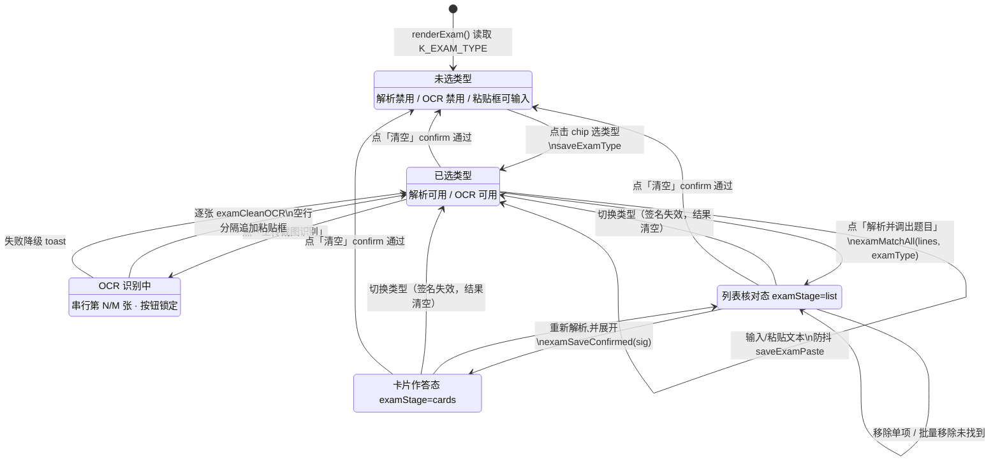
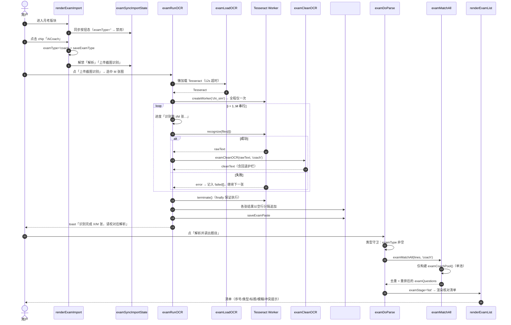
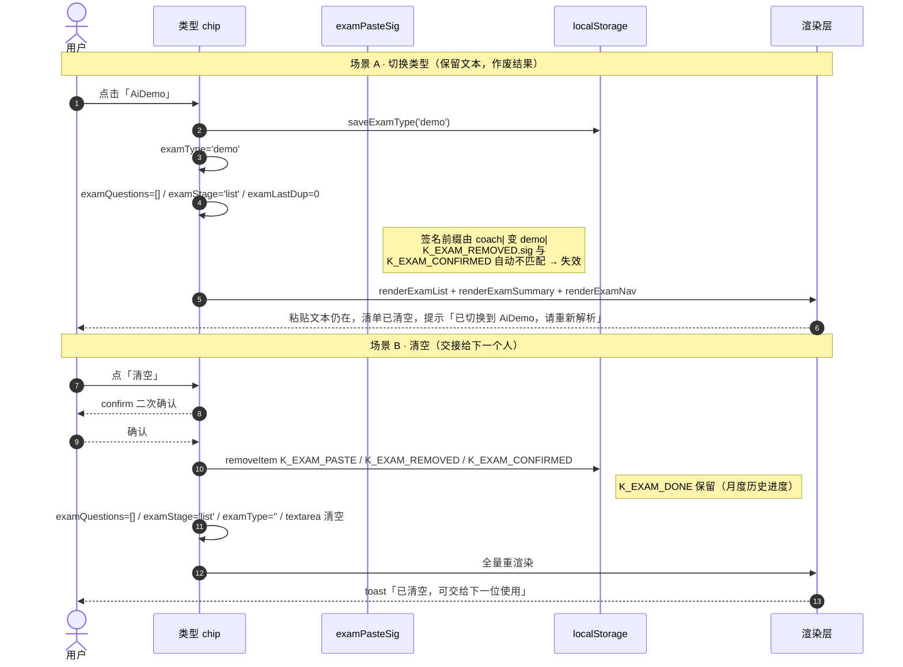
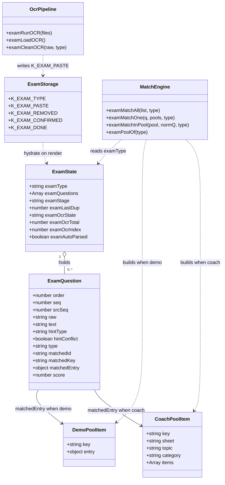
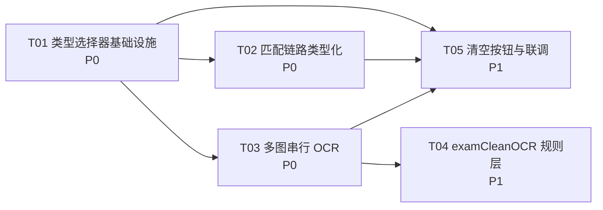

# 知鸟答案工作台 · 月考模式增量设计文档 v2.0

> 架构师：高见远（software-architect）
> 目标文件：`/Users/zhoujiale/WorkBuddy/2026-08-04-16-18-01/知鸟答案工作台.html`（单文件 HTML，inline CSS + JS，当前 3512 行）
> 版本：v2.0（增量设计，**不含实现代码**）
> 上游版本：v1.0（解析去重 / 匹配去重 / Dice 0.60 / 包含匹配长度比护栏 / 列表核对态 / 确认态持久化 / 批量移除未找到）
> 覆盖诉求：① 先选考试类型再提取题目 ② 多图 OCR ③ 清空按钮 ④ 基于截图学习的 OCR 后处理规则

---

## 1. 增量设计概述

本次增量的核心是**把「考试类型」从「匹配后的推断结果」前移为「流程开始前的用户输入」**，由此形成一条更短、更确定的主链路：`选类型 → 粘贴/OCR → 解析 → 列表核对 → 卡片作答`。类型一旦确定，`examMatchAll` 只在单一数据池（AiCoach→`RAW_DATA`/`data`，AiDemo→`DEMO_DATA`）内检索，候选集规模直接减半、跨池误命中（话术题匹配到同名演示条目）从概率问题变为结构上不可能，同时省掉 `examMatchOne` 中 coach/demo 双池打分与 `hintType ±0.05` 排序偏好这段最容易出错的逻辑。围绕这个主轴，配套三项体验改造：**多图串行 OCR**（单 worker 复用、逐张进度、单张失败不中断），**`examCleanOCR` 后处理层**（从两张真实截图沉淀的界面噪声规则表，带「删得过多就自动回退」的保守护栏），**一键清空**（清掉本次会话的文本/解析/移除/确认，但**保留** `K_EXAM_DONE` 月度历史进度）。

关键工程手法是**把 `examType` 纳入 `examPasteSig` 签名**——移除列表与确认态本就以签名为护栏，签名带上类型后，"切换类型自动作废旧的核对/确认结果"这件事无需任何额外清理代码即可成立，改动面最小、状态一致性最强。全部改动仍为零后端、零新增依赖、纯静态单文件部署，视觉沿用既有 Apple 极简语言与 `--exam-accent` 紫色 token。

---

## 2. 改动文件与代码位置清单

单文件应用，下表「区块」即同一 HTML 内的代码段。行号基于**当前 3512 行版本**，实现时以**函数名/选择器为准**，行号仅作导航。

| # | 区块 | 行号范围 | 改动性质 | 说明 |
|---|------|---------|---------|------|
| **C1** | CSS · 月考样式 | `618–668` | **新增（追加）** | 在 `.exam-import h3`（621）后追加类型选择器样式 `.exam-typebar` / `.exam-typechip` / `.exam-typechip.active` / `.exam-typechip[data-type]` 主题着色；在 `.exam-row`（624）后追加 `.exam-btn.danger`、`.exam-ocr-progress`、`.exam-conflict`；移动端断点（668）补 `.exam-typebar{flex-wrap:wrap}`。**既有类一律不动。** |
| **C2** | JS · localStorage 常量 | `1048–1050` | **修改（追加 1 行）** | 追加 `const K_EXAM_TYPE='wb_zhiniao_exam_type';` |
| **C3** | JS · 月考状态变量 | `1084–1086` | **修改** | `let examQuestions=[], examOcrState='idle', examAutoParsed=false;` 追加 `examType=''`；新增 `examOcrTotal=0, examOcrIndex=0`。 |
| **C4** | JS · OCR 常量表 | `2160` 前后 | **新增** | 新增 `EXAM_OCR_NOISE_EXACT` / `EXAM_OCR_NOISE_SUB` / `EXAM_OCR_TAIL_BTN` / `EXAM_CATEGORY_HINTS` / `EXAM_OCR_KEEP_RATIO` 五个常量，与既有 `EXAM_CIRCLED`、`EXAM_CN_NUM` 同区。 |
| **C5** | JS · 类型读写 | `2414` 附近（草稿区） | **新增** | `loadExamType()` / `saveExamType(t)` / `examPoolOf(type)`，与 `loadExamPaste`/`saveExamPaste` 同区，保持风格一致。 |
| **C6** | JS · `examPasteSig` | `2425–2430` | **修改（关键）** | 返回值前缀加类型：`(examType||'none') + '|' + s.length + '-' + hash`。**调用方全部无需改动**（2633/2644/2653/2750/2762/2768/2769），切类型即自动作废旧移除列表与确认态。 |
| **C7** | JS · `examMatchOne` | `2332–2362` | **重构** | 签名改 `examMatchOne(q, pools, type)`；删除双池打分与 `±0.05` 偏好；只在 `type` 对应池检索；`hintType` 与 `type` 冲突时**只打标记不改池**，输出 `hintConflict:true`。 |
| **C8** | JS · `examMatchAll` | `2406–2412` | **修改** | 签名改 `examMatchAll(list, type)`；按 `type` **只构建一个池**（`examCoachPool()` 或 `examDemoPool()`），不再同时构建两个。 |
| **C9** | JS · `examCleanOCR` | `2932` 后（OCR 区） | **新增** | 纯函数 `examCleanOCR(rawText, type)`，按 §6 规则表清洗，含 `EXAM_OCR_KEEP_RATIO` 回退护栏。 |
| **C10** | JS · `examRunOCR` | `2894–2932` | **重构** | `input.multiple=true`；单 worker 串行识别 N 张；逐张进度回调；单张失败收集不中断；结果逐张过 `examCleanOCR` 后以空行分隔合并追加。 |
| **C11** | JS · `examClearSession` | `2832` 后（汇总区） | **新增** | 清空当前会话：`K_EXAM_PASTE` / `examQuestions` / `K_EXAM_REMOVED` / `K_EXAM_CONFIRMED` / `examStage` / `examLastDup`；**保留 `K_EXAM_DONE`**。 |
| **C12** | JS · `renderExamImport` | `2782–2803` | **修改** | 注入类型选择器 DOM（位于 `<h3>` 与 `<textarea>` 之间）；新增「清空」按钮；新增 `.exam-ocr-progress` 容器；绑定类型 chip 点击；调用 `examSyncImportState()`。 |
| **C13** | JS · `examSyncImportState` | `2803` 后 | **新增** | 单一职责：按 `examType` 同步「解析/OCR 按钮 disabled 态 + chip active 态 + 提示文案」，供初始化、切类型、清空、OCR 前后统一调用。 |
| **C14** | JS · `examDoParse` | `2746–2779` | **修改** | 开头加类型守卫（未选类型 → toast + return）；`examMatchAll(lines, examType)`；toast 文案带类型名。 |
| **C15** | JS · `renderExamList` | `2592–2623` | **修改（小）** | 空态文案区分「未选类型」与「已选类型但无题目」；命中行在 `hintConflict` 时追加 `.exam-conflict` 徽标。 |
| **C16** | JS · `renderExam` | `2850–2861` | **修改** | 首次渲染前 `examType=loadExamType()`；自动还原解析（2853）增加 `examType` 非空前置条件。 |
| **C17** | JS · `renderExamNav` | `2834–2848` | **修改（文案）** | 侧栏「月考模式」增加「考试类型」一行；「用法」文案更新为新五步流程。 |

> **不改动**：`examCoachPool` / `examDemoPool` / `examMatchInPool` / `examDedupeMatched` / `examReindex` / `examParseLines` / `examNorm` / `examDice` / 卡片 HTML 生成 / 完成进度读写。v1.0 的算法内核完全复用。

---

## 3. 数据结构 / 状态变更

### 3.1 新增全局状态

| 变量 | 类型 | 初值 | 说明 |
|------|------|------|------|
| `examType` | `'' \| 'coach' \| 'demo'` | `loadExamType()` | 当前考试类型；`''` 表示未选择（阻断解析） |
| `examOcrTotal` | `number` | `0` | 本次 OCR 待识别图片总数 |
| `examOcrIndex` | `number` | `0` | 本次 OCR 已完成张数（用于「第 N/M 张」） |

### 3.2 新增 localStorage key

| Key 常量 | 存储键 | 值 | 生命周期 |
|---------|--------|----|---------|
| `K_EXAM_TYPE` | `wb_zhiniao_exam_type` | `'coach'` / `'demo'` / `''` | 长期记忆上次选择；点「清空」时**一并重置**（见 §8 待明确 D3） |

### 3.3 类型 → 数据池映射

```
examPoolOf('coach') → { coach: examCoachPool() }   // 源：data（RAW_DATA 派生）
examPoolOf('demo')  → { demo:  examDemoPool()  }   // 源：DEMO_DATA
examPoolOf('')      → null                          // 阻断，不允许解析
```

| 类型值 | 界面名 | 数据源 | 池构建函数 | 卡片渲染 | 徽标 CSS |
|--------|--------|--------|-----------|---------|---------|
| `coach` | AiCoach · 话术 | `data`（`!isFollowUp && status!=='archived'`） | `examCoachPool()` | `examCoachCardHTML` | `.exam-type.coach` |
| `demo` | AiDemo · 演示 | `DEMO_DATA`（`status!=='archived'`） | `examDemoPool()` | `examDemoCardHTML` | `.exam-type.demo` |

### 3.4 `examPasteSig` 语义变更（关键）

```
v1.0：  sig = len + '-' + djb2(raw).toString(36)
v2.0：  sig = (examType || 'none') + '|' + len + '-' + djb2(raw).toString(36)
```

**收益**：`K_EXAM_REMOVED.sig` 与 `K_EXAM_CONFIRMED` 均以此签名做护栏。类型一变 → 签名一变 → 旧移除列表与旧确认态**自动失效**，无需在切换分支里写任何清理代码，杜绝"类型切了但确认态还留着"的脏状态。

### 3.5 题目对象（`examQuestions[i]`）字段增量

| 字段 | 类型 | 说明 |
|------|------|------|
| `hintConflict` | `boolean` | 新增。行内 `[演示]`/`[话术]` 标记与当前 `examType` 不一致时为 `true`，仅用于列表核对态提示复核，**不改变匹配池** |

其余字段（`order/seq/raw/text/hintType/type/matchedId/matchedKey/matchedEntry/score/srcSeq`）保持 v1.0 不变。

### 3.6 OCR 常量表（新增，供 §6 规则引用）

| 常量 | 类型 | 内容概要 |
|------|------|---------|
| `EXAM_OCR_NOISE_EXACT` | `Set<string>` | 整行全等即删：测试 / 练习 / 任务 / 内容 / 已完成 / 已通过 / 已练习 / 已达标 / 未练习 / 未通过 / 全部 / 更多 / 查看更多 / 开始学习 / 继续学习 |
| `EXAM_OCR_NOISE_SUB` | `string[]` | 命中子串即删整行：剩余学习时长 / 学习时长 / 剩余时长 / 学习进度 / 我的学习 |
| `EXAM_OCR_TAIL_BTN` | `RegExp` | 行尾按钮词剥离：`/(\s*(练习|测试|去练习|去测试)){1,3}\s*$/` |
| `EXAM_CATEGORY_HINTS` | `string[]` | iPhone / iPad / Mac / Apple Watch / AppleCare / AirPods / HomePod / Apple TV / 配件 / 服务 / 在你身边 / 以旧换新 / 保障服务 |
| `EXAM_OCR_KEEP_RATIO` | `number` | `0.3`，清洗保留率下限，低于则回退（见 R10） |

> `EXAM_CATEGORY_HINTS` 与库内真实分类对齐参考：`sheet` 取值为「在你身边 / 配件和服务销售话术系列 / Watch销售话术系列 / iPad销售话术系列 / Mac销售话术系列 / iPhone销售话术系列」，`category` 取值为「推荐产品优势 / 向顾客推荐店内服务 / 应对个性需求 / 推荐服务 / AppleCare / 推荐配件 / 解答常见问题 / 解决常见问题 / 常见顾客问题 / 深入了解卖点」。

---

## 4. 调用流程

### 4.1 状态机



### 4.2 关键时序：多图 OCR → 清洗 → 解析



### 4.3 关键时序：切换类型与清空



### 4.4 数据结构关系图



---

## 5. 任务分解列表

> 硬性约束：共 **5 个任务**，按实现顺序排列。每个任务自带验收标准。

### T01 · 考试类型选择器基础设施 · P0 · 依赖：无

**改动点**：C1（部分）、C2、C3（`examType`）、C5、C12（部分）、C13、C16、C17

| 项 | 内容 |
|----|------|
| CSS | 新增 `.exam-typebar`（flex/gap 8px/margin-bottom 12px）、`.exam-typechip`（沿用 `.chip` 圆角 999px + 0.5px 描边 + `transition .18s var(--spring)` + `:active{transform:scale(.96)}`）、`.exam-typechip.active[data-type="coach"]`（`--coach-accent` 实心）、`.exam-typechip.active[data-type="demo"]`（`--demo-accent` 实心） |
| 常量 | `K_EXAM_TYPE='wb_zhiniao_exam_type'` |
| 状态 | `examType=''`；`loadExamType()` / `saveExamType(t)` / `examPoolOf(type)` |
| DOM | `renderExamImport` 在 `<h3>粘贴题目清单</h3>` 与 `<textarea>` 之间注入类型栏：`<div class="exam-typebar"><span class="exam-typebar-label">考试类型</span><button class="exam-typechip" data-type="coach">AiCoach · 话术</button><button class="exam-typechip" data-type="demo">AiDemo · 演示</button></div>` |
| 逻辑 | `examSyncImportState()`：按 `examType` 统一同步 chip `.active`、`#examParse[disabled]`、`#examOcr[disabled]`、`.exam-hint` 文案；chip 点击 → 写状态 + 持久化 + 清空 `examQuestions`/`examStage`/`examLastDup` + 重渲染 + toast |
| 初始化 | `renderExam()` 首行 `examType=loadExamType()`；自动还原解析（2853）追加 `examType` 非空条件 |
| 侧栏 | `renderExamNav` 增加「考试类型」行 + 更新「用法」文案 |

**验收**：① 首次进入无类型 → 两个按钮灰态不可点，chip 无 active；② 选类型后按钮可点，刷新后类型仍在；③ 切换类型 → 粘贴文本保留、清单清空、toast 提示；④ 深浅色模式下 chip 对比度正常。

---

### T02 · 匹配链路类型化 · P0 · 依赖：T01

**改动点**：C6、C7、C8、C14、C15

| 项 | 内容 |
|----|------|
| 签名 | `examPasteSig` 前缀加 `(examType||'none')+'\|'`，调用方零改动 |
| 匹配 | `examMatchAll(list, type)` 仅构建单池；`examMatchOne(q, pools, type)` 删除双池打分与 `±0.05` 偏好，只查单池 |
| 冲突 | `hintType && hintType!==type` → `hintConflict=true`，**不切池** |
| 守卫 | `examDoParse` 开头：`if(!examType){ showToast('请先选择考试类型'); return; }` |
| 列表 | `renderExamList` 命中行在 `hintConflict` 时追加 `<span class="exam-conflict">标记为演示，请复核</span>`；空态文案区分未选类型 |
| 文案 | 解析 toast 带类型名：`已解析 N 题（AiCoach）…` |

**验收**：① coach 模式下含「演示」字样的题只在话术池匹配，不再出现 demo 卡片；② 同一份文本先 coach 解析并确认，切 demo 后清单为空且不复用旧确认态；③ `[演示]` 标记在 coach 模式下显示冲突徽标但仍按话术匹配；④ 未选类型时点解析（若绕过 disabled）有明确 toast。

---

### T03 · 多图串行 OCR · P0 · 依赖：T01

**改动点**：C1（`.exam-ocr-progress`）、C3（`examOcrTotal`/`examOcrIndex`）、C10、C12（进度容器）

| 项 | 内容 |
|----|------|
| input | `input.multiple=true`；`Array.from(input.files)`；建议上限 9 张，超出取前 9 并 toast 提示 |
| worker | `createWorker('chi_sim')` **全程仅一次**；`try/finally` 中 `terminate()`，保证异常路径也释放 |
| 串行 | `for...of` + `await`（或 `reduce` Promise 链），**禁止 `Promise.all`** |
| 进度 | 按钮文案 `识别 N/M…`；`.exam-ocr-progress` 显示当前文件名与逐张结果（✓/✗） |
| 容错 | 单张 `try/catch` 收集 `failed[]`，不中断；全部失败才置 `examOcrState='failed'` 并禁用按钮 |
| 合并 | 每张结果先过 `examCleanOCR`（T04 落地前先用现有 trim 逻辑占位），非空者以**空行**分隔，整体追加到粘贴框末尾并 `saveExamPaste` |
| 收尾 | `examOcrState` 复位；清空 `input`；调用 `examSyncImportState()` |

**验收**：① 一次选 3 张图能全部识别，粘贴框内容以空行分段；② 中间一张损坏图不中断，末尾 toast 报「成功 2/3」；③ DevTools 中全程只创建 1 个 worker 且识别后被 terminate；④ 识别中重复点击按钮无副作用。

---

### T04 · `examCleanOCR` 后处理规则层 · P1 · 依赖：T03

**改动点**：C4、C9、C10（接入点）

| 项 | 内容 |
|----|------|
| 常量 | 落地 §3.6 五个常量表 |
| 函数 | `examCleanOCR(rawText, type)` 纯函数，按 §6 规则表**严格按优先级**执行 |
| 护栏 | 清洗后有效行数 / 原有效行数 < `EXAM_OCR_KEEP_RATIO`(0.3) 且原行数 ≥ 6 → **回退**为仅执行 R1+R4，并 toast「已保留原始识别结果，请手动核对」 |
| 类型差异 | `type==='demo'` 时对 `EXAM_OCR_NOISE_EXACT` 中的「练习」放宽（演示题干可能含该词）；`type==='coach'` 时全量启用 |
| 接入 | T03 的占位替换为真实调用 |

**验收**：① 用两张真实截图跑通，「测试」「练习」「剩余学习时长 2:52:20」「任务/已完成/已通过」等噪声行被清掉；② 「iPhone 17 诚意满满大…」「AC_Mono / 维修政策之维修周期」等题干**完整保留**；③ 「iPhone」「Apple Watch」等分类标题行不进入题目；④ 构造一张全是噪声词的图，验证回退护栏被触发。

---

### T05 · 清空按钮与全流程联调 · P1 · 依赖：T01, T02, T03

**改动点**：C1（`.exam-btn.danger`）、C11、C12（按钮）、C15、C17

| 项 | 内容 |
|----|------|
| CSS | `.exam-btn.danger`：`color:var(--red)`、`border-color:var(--red)`、透明底，`:active{background:rgba(255,55,95,.08)}`，与 `.exam-list-remove` 的红色语义一致 |
| DOM | `.exam-row` 末尾追加 `<button class="exam-btn ghost danger" id="examClearAll">清空</button>`，`margin-left:auto` 与前两个按钮拉开距离 |
| 逻辑 | `examClearSession()`：`confirm('确认清空本次月考数据？\n将清除粘贴的题目清单与当前解析结果，本月「已完成」进度会保留。')` → 通过后清 `K_EXAM_PASTE`/`K_EXAM_REMOVED`/`K_EXAM_CONFIRMED` + `examQuestions=[]` + `examStage='list'` + `examLastDup=0` + textarea 置空 + 重置 `examType=''` 并清 `K_EXAM_TYPE`（见 D3）→ 全量重渲染 + toast |
| 保留 | **绝不触碰 `K_EXAM_DONE`**；`examClearDone`（2820 既有「清空完成进度」）保持独立，两个按钮语义不重叠 |
| 联调 | 五步全链路走查 + 移动端 860px 断点 + 深色模式 + 空态文案一致性 |

**验收**：① 点清空 → confirm → 全部导入态归零，但切到卡片态再解析同样内容时「已完成」标记仍在；② 取消 confirm 不产生任何变更；③ 清空后 UI 回到「未选类型」初始态，与首次打开完全一致；④ 与既有「清空完成进度」按钮视觉/语义不混淆。

### 任务依赖图



---

## 6. OCR 后处理规则表

**总原则：宁可少删，不可多删。** 题干误删无法恢复（用户看不出少了什么），噪声残留只是多一行让用户在核对清单里点「移除」——后者已有 v1.0 的兜底 UI。规则按下表**优先级顺序**执行。

| 优先级 | 规则 | 触发条件 | 示例（截图实证） | 处理 | 风险 / 缓解 |
|:---:|------|---------|-----------------|------|------------|
| **R1** | 行修剪 | 每行 `trim()`，丢弃空行 | `"  测试  "` → `"测试"` | 修剪 | 无 |
| **R2** | 纯数字/时间/进度行 | `/^\d+$/`、`/^\d{1,2}:\d{2}(:\d{2})?$/`、`/^\d+\s*\/\s*\d+$/`、`/^\d+%$/`、`/^\d+\s*(个|项|条|分钟|小时)$/` | `2:52:20`、`12`、`3/8`、`75%` | 删整行 | 题干极少为纯数字；风险极低 |
| **R3** | 纯符号行 | 去标点后长度为 0 | `"···"`、`"——"`、`"\|"` | 删整行 | 无 |
| **R4** | 界面噪声词全等 | 归一化后 ∈ `EXAM_OCR_NOISE_EXACT` | `测试`、`练习`、`任务`、`已完成`、`已通过`、`内容`、`已练习`、`已达标`、`未练习` | 删整行 | 中：题干若恰为「练习」二字会误删——但库内无此类 2 字题目；demo 模式对「练习」放宽 |
| **R5** | 界面噪声词包含 | 行内命中 `EXAM_OCR_NOISE_SUB` 任一 | `剩余学习时长 2:52:20`、`学习进度-话术` | 删整行 | 低：这些短语不会出现在题干中 |
| **R6** | 行尾按钮词剥离 | 行尾匹配 `EXAM_OCR_TAIL_BTN` **且**剥离后剩余长度 ≥ 4 | `AC_Mono / 维修政策之维修周期 练习 测试` → `AC_Mono / 维修政策之维修周期` | **只剥尾部，保留正文** | 低。**长度守卫是关键**：剥离后 < 4 字则整体不动，避免把短题干削没 |
| **R7** | 分类标题行 | 归一化后长度 ≤ 12 **且**全等于 `EXAM_CATEGORY_HINTS` 任一 | `iPhone`、`Apple Watch`、`AppleCare`、`配件` | 删整行（不作为题目）；可选记为 `lastCategory` | 中：`AppleCare` 同时是真实 `category` 值，但库内题目标题均更长，**全等**约束足够安全 |
| **R8** | 超短残行 | `examNorm(line).length < 3` | `"iP"`、`"…"`、`"下"` | 删整行 | 低：库内最短 topic 远超 3 字 |
| **R9** | 重复行 | —— | —— | **不处理**，交由 `examParseLines` 既有归一化去重 | 职责单一，避免双重去重导致行为不可预测 |
| **R10** | 保守回退护栏 | 原有效行数 ≥ 6 **且** 清洗后行数/原行数 < `0.3` | 规则集对某类新界面误伤 | **整体回退**为仅执行 R1+R2 的结果，并 toast 提示手动核对 | —— 这条本身就是缓解措施 |

### 规则设计说明

- **R6 是本轮最有价值的规则**。两张截图中「练习」「测试」都是卡片右下角按钮，OCR 极易与标题识别在同一行；直接按 R4 删整行会连题干一起丢失，所以必须先做 R6 尾部剥离、再做 R4 全等判断——**R6 优先级高于 R4 的执行位置不可调换**（表中 R4 在前是指「全等判断」，R6 处理的是「非全等的混合行」，实现上应先尝试 R6 剥离，剥离后若变为全等噪声再由 R4 兜底）。
- **R7 只用全等不用包含**。`iPhone` 作为包含条件会误删「iPhone 17 诚意满满大…」这类真实题干，必须全等。
- **`type` 参数的作用**：`coach` 模式（对应「学习进度-话术」类截图）噪声词更多、全量启用；`demo` 模式对「练习」「内容」放宽，因为演示题干措辞更自由。
- **不做的事**：不做 OCR 形近字纠正（O/0、l/1）——v1.0 已在 `examFullToHalf` 注释中明确该策略会破坏「iPhone 16」这类产品名；不做语义补全；不做跨行合并（换行位置不可靠，合并风险高于收益）。

---

## 7. 共享约定

### 7.1 CSS 类命名

| 类名 | 用途 | 归属 |
|------|------|------|
| `.exam-typebar` | 类型选择器容器 | 新增 |
| `.exam-typebar-label` | 「考试类型」标签文字 | 新增 |
| `.exam-typechip` | 类型 pill 按钮 | 新增 |
| `.exam-typechip.active` | 选中态 | 新增 |
| `.exam-ocr-progress` | 多图识别进度条容器 | 新增 |
| `.exam-conflict` | 标记与类型冲突的复核徽标 | 新增 |
| `.exam-btn.danger` | 危险操作（清空） | 新增修饰符 |

**命名规则**：一律 `exam-` 前缀 + 小写连字符，与 `.exam-list-row`、`.exam-list-foot`、`.exam-seq` 既有体系一致。修饰符用附加类（`.active` / `.ghost` / `.danger` / `.miss`），不用 BEM `--`。

### 7.2 视觉一致性要点

1. **主题色**：月考版块整体 `--exam-accent:#7c5cfc`（`body.exam-section` 已把 `--accent` 重定向）。但**类型 chip 选中态用各自的品牌色**——AiCoach 用 `--coach-accent`（蓝）、AiDemo 用 `--demo-accent`（橙），与列表行 `.exam-type.coach` / `.exam-type.demo` 徽标配色形成呼应，让用户"选的颜色"和"结果里看到的颜色"一致。未选中态为 `--surface-2` 底 + `--text2` 字 + `0.5px solid var(--line)` 描边。
2. **按压反馈**：所有新增可点元素统一 `transition: all .18s var(--spring)` + `:active{transform:scale(.96)}`，与 `.chip:active`、`.exam-list-row:active` 保持同一手感。
3. **描边**：新增卡片级容器用 `0.5px solid var(--line-strong)`，按钮/chip 用 `0.5px solid var(--line)`，遵循既有 hairline 规范。
4. **禁用态**：复用 `.exam-btn[disabled]{opacity:.5;cursor:not-allowed}`，**不新增禁用样式**。
5. **圆角**：chip 用 `999px`；容器用 `var(--radius)`；按钮用 `var(--radius-sm)`。
6. **字号**：chip 13px/500、标签 12.5px/`--text3`、提示文案 12.5px/`--text2`，与 `.exam-hint`、`.exam-list-tip` 对齐。
7. **负字距**：标题类文本延续 `letter-spacing:-0.01em`。
8. **反馈通道统一**：所有操作反馈走 `showToast(msg)`，二次确认走原生 `confirm()`（与 1393/1704/2028 三处既有下架确认保持一致，不引入自定义弹窗）。
9. **移动端**：`@media(max-width:860px)` 断点内保证类型栏可换行、清空按钮不与解析按钮挤在一行。

### 7.3 代码约定

- 沿用文件既有风格：`function(){}` 表达式为主、`const/let`、模板字符串、`try{}catch(e){}` 包裹所有 `localStorage` 访问。
- 所有插入 DOM 的用户文本必须经 `esc()`。
- 新增纯函数（`examCleanOCR`、`examPoolOf`）不得读写全局状态，便于单测与回归。
- 状态同步收敛到 `examSyncImportState()` 单一入口，禁止在多处分散修改按钮 `disabled`。

---

## 8. 待明确事项

| # | 决策点 | 我的推荐 | 理由 | 影响面 |
|:---:|--------|---------|------|--------|
| **D1** | 切换类型时是否清空粘贴文本？ | **保留文本，只清解析结果** | 粘贴/OCR 是用户成本最高的输入，清掉等于惩罚"选错类型"；解析结果与类型强绑定，必须清。切换后 toast 明确提示「已切换到 X，请重新解析」 | T01、T02 |
| **D2** | 未选类型时 OCR 按钮是否禁用？ | **禁用** | 虽然识别本身与类型无关，但 `examCleanOCR(raw, type)` 的规则集依类型分化（coach 噪声词全量、demo 放宽），先选类型能拿到更准的清洗结果；且与用户诉求一致，交互上也更简单（两个按钮同一禁用条件） | T01、T03、T04 |
| **D3** | 「清空」是否一并重置考试类型？ | **重置** | 清空的语义是"交接给下一个人"，下一位大概率是不同类型；保留旧类型反而制造隐性错误。若担心自己重复使用麻烦，`K_EXAM_TYPE` 的持久化已覆盖"同一人多次使用"场景 | T05 |
| **D4** | 多图上传的张数上限 | **9 张**，超出取前 9 并提示 | 单张中文识别约 3–8 秒，9 张最坏约 1 分钟已是耐心上限；且移动端内存有压力 | T03 |
| **D5** | `[话术]`/`[演示]` 行内标记的最终定位 | **保留解析（剥离标记文字避免污染匹配），仅在冲突时显示复核徽标，不跨池** | 标记文字若不剥离会拉低 Dice 分；但选类型后标记的"路由"职责已被取代，降级为提示最合理 | T02 |
| **D6** | 是否需要「一键切换并重新解析」快捷操作 | **本期不做** | 切类型后用户只需再点一次「解析」，多一步但语义清晰；自动重解析会让用户误以为切换是无损的 | —— |
| **D7** | `examCleanOCR` 的分类标题是否要写回 `category` 参与匹配加权 | **本期只做跳过，不参与匹配** | 分类归属的准确率取决于 OCR 分组还原能力，不可靠；贸然加权可能反向拉低精度。留作 v3 观察项 | T04 |
| **D8** | 是否为「未选类型」提供默认值（如记住上次） | **提供**（`K_EXAM_TYPE` 已实现），但**首次使用必须显式选择** | 老用户零摩擦，新用户强制建立"先选类型"的心智 | T01 |

---

## 9. 风险与回归清单

| 风险 | 等级 | 缓解 |
|------|:---:|------|
| `examPasteSig` 语义变更导致老用户已确认的清单失效（刷新后回到核对态） | 低 | 一次性影响，且回到核对态无数据损失；`K_EXAM_DONE` 不受影响 |
| 单池匹配后，用户选错类型将导致全部题目「未找到」 | 中 | 列表核对态会直观显示大面积「未找到」；空态/大量未命中时 toast 提示「若大量未找到，请检查考试类型是否选对」 |
| 多图 OCR 长时间占用主线程导致页面卡顿 | 中 | Tesseract worker 本身在 Worker 线程；串行 + 张数上限 + 进度反馈缓解感知 |
| `examCleanOCR` 规则误删题干 | 中 | R6 长度守卫 + R7 全等约束 + R10 回退护栏三层防护；且核对清单可人工补 |
| 单 worker 复用时某张图异常导致 worker 状态污染 | 低 | 单张 `catch` 后继续；若连续 2 张失败则重建 worker（实现时加此保护） |

**回归必测**：v1.0 已有的解析去重、匹配去重、Dice 阈值、包含匹配长度比、移除单项/批量移除、确认态持久化、跨月完成进度清零，全部需在类型化改造后重跑一遍。
